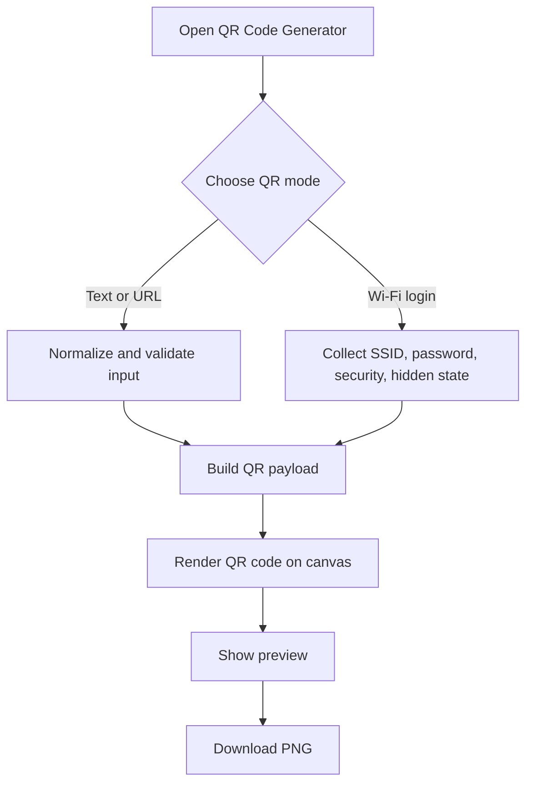

## Github Page
[qr-generator](https://aeonscry.github.io/qr-code-generator/)

This is a [Next.js](https://nextjs.org) project bootstrapped with [`create-next-app`](https://nextjs.org/docs/app/api-reference/cli/create-next-app).

## Getting Started

First, run the development server:

```bash
npm run dev
# or
# QR Code Generator

A small Next.js app for creating downloadable QR codes from text, URLs, and Wi-Fi login details.

## Features

- Generate QR codes from text or URLs.
- Normalize domain-like input by adding `https://` when needed.
- Create Wi-Fi login QR codes for WPA/WPA2/WPA3, WEP, and open networks.
- Support hidden Wi-Fi networks.
- Choose the generated image size and download a PNG.
- Generate everything locally in the browser; entered values are not sent to an application server.
- Adapt the interface for light and dark system themes.

## Getting Started

Install dependencies and start the development server:

```bash
npm install
npm run dev
```

Open [http://localhost:3000](http://localhost:3000).

## Usage

Select a mode from the tabs:

- **Text or URL** accepts arbitrary text and validates HTTP(S) URLs.
- **Wi-Fi login** builds the standard `WIFI:` QR payload from the network name, password, security type, and hidden-network setting.

Choose **Generate**, then use **Download PNG** to save the result.

## Project Flow



## Scripts

| Command | Description |
| --- | --- |
| `npm run dev` | Start the development server |
| `npm run build` | Create a production build |
| `npm run start` | Serve the production build |
| `npm run lint` | Run ESLint |

## Tech Stack

- Next.js 16 with the App Router
- React 19
- TypeScript
- Tailwind CSS
- [`qrcode`](https://www.npmjs.com/package/qrcode)
